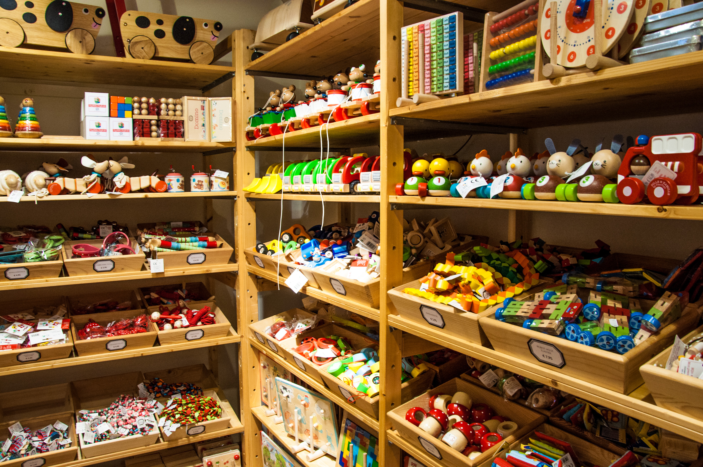
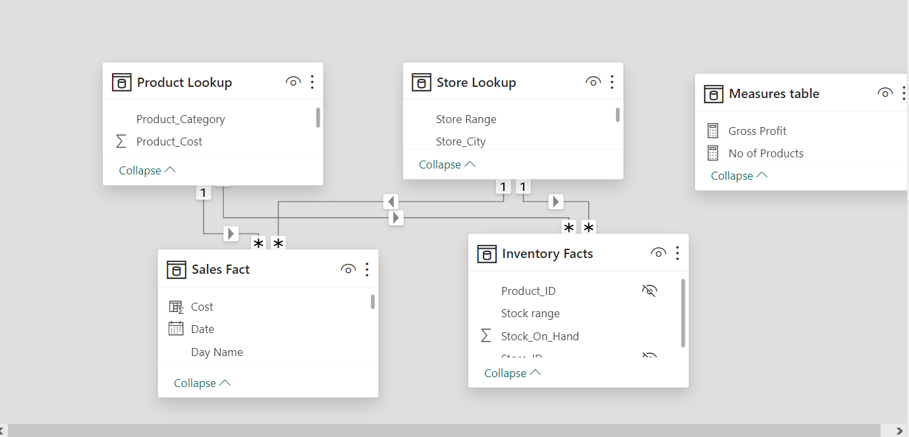
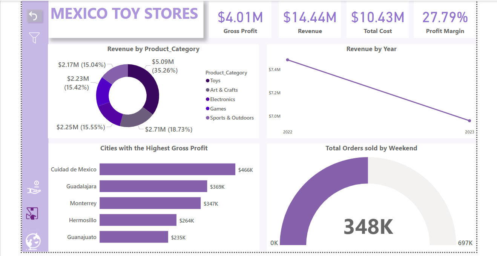
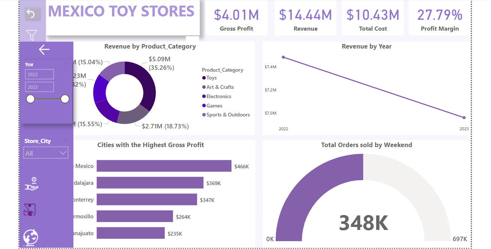
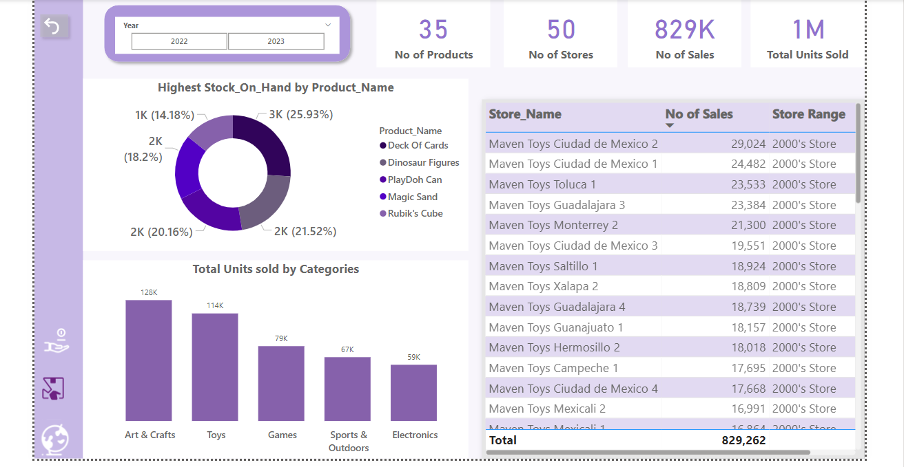
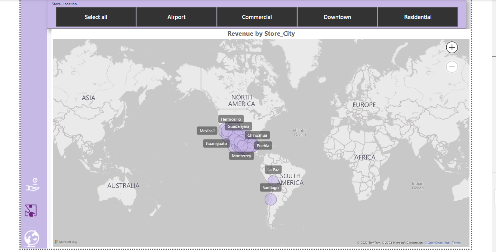

# Mexico-Toy-Stores

## Mexico Toy Analysis

---

## Introduction
Mexico, country of southern North America and the third largest country in Latin America, after Brazil and Argentina. The toy stores in Mexico are our area of focus, hence why we are trying to analyze the stores that sell toys. The project aims to generate top tier KPI, which executives would love to see, to generate insights from. Also, KPIs for the managers to be able to keep tabs on the products, sales and so many others. The projects analysis was carried out using Power bi.

## Problem Statement
1.	What product category is driving top revenue?
2.	What was the revenue made yearly?
3.	What are the cities with the highest gross profit?
4.	Are the sales on weekends higher than the sales on weekdays?
•	What product is the highest stock on hand? And is that product amongst the products with the highest units sold?
•	Are the stores founded in the 2000’s making more sales as compared to the stores in the 1990’s?

## Data Source
This data was gotten from the Maven Analytics playground. Here is the (link) https://mavenanalytics.io/data-playground?search=mexico for your reference.
It contains 4 tables.

1.Inventory table with 1,593 rows and 3 columns.

2.Product table with 35 rows and 5 columns

3.Sales table with 829,262 rows and 9 columns

4.Store table with 50 rows and 5 columns

## Data Cleaning
On getting my hands on the data, I transformed the data using power query editor. 
On the sales table, I simply transformed the data. I extracted the year from the date column. Also extracted the day name and the month name. Also used SWITCH Function on Month name. And, I used the IF(OR …) statement on Day name.
On the inventory table, I added a conditional column named stock range.
On the store table, I added a conditional column named store range.

## Data Analysis with DAX functions
I created a measures table using the Enter data from the home tab. There I housed all my measures for more efficiency and easy access to my measures.
Functions used includes, COUNT, SUM AND CALCULATE.

## Data Modelling
This model has 2 facts table and 2 dimension tables.

---

## Data Visualization
The visualization is a three page report. comprises of an executive dashboard with a hidden filter pane, produt dashbaord and a map for navigation.
You can interact with the visualization (here) https://app.powerbi.com/view?r=eyJrIjoiY2FmZGUzODItNzE3Yy00MGYyLThkZmEtM2RiMzQ0YmJmODIwIiwidCI6ImUyODE5OGNhLTExOWQtNDhmOC1iYzBlLTczMzIxYTM4YzJlMyJ9

## Executive dashboard
Exec dashboard      |  Exec dashboard with filter
:------------------:|:--------------------------:
  | 
---

## Product dashboard

---

## Map

---

## Insights and Recommendation
It was gathered that the revenue we realized in 2022 was higher than what we realized in 2023. 2023 saw a drastic decline from 2022(7.4M) to 2023(6.9M) which ultimately affected our gross profit.
We also had many stocks at hand for goods that are not in high demand, which ultimately would just take a longer time to buy. The recommendation for this said case would be to increase the number of stocks for products that are more sought after.
 The stores with the highest numbers of sales are the stores that opened in the 2000’s as compared to the stores opened in the 1990’s. This may be because the customers do not find these said stores to be as enticing to what to get anything from, hence why a recommendation for a remodeling would be advised.

---

